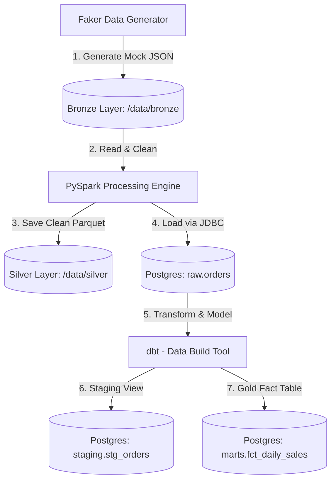
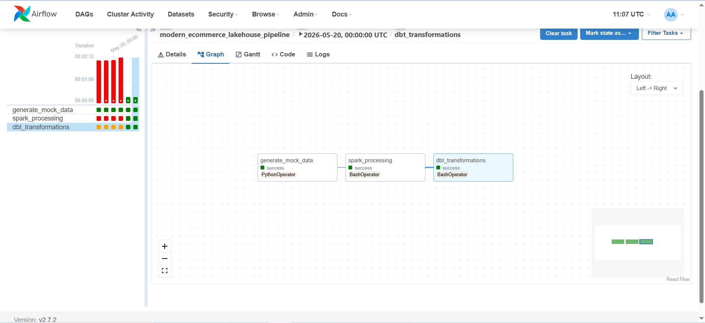

# Modern E-Commerce Analytics Lakehouse Pipeline 🚀

[](https://www.docker.com/)
[](https://airflow.apache.org/)
[](https://spark.apache.org/)
[](https://www.getdbt.com/)
[](https://www.postgresql.org/)

An end-to-end Data Engineering pipeline simulating a production-grade **Modern Data Lakehouse Architecture** for e-commerce analytical tracking. The project implements the **Medallion (Bronze -> Silver -> Gold)** architecture to ingest, process, clean, and model simulated e-commerce orders data.

---

## 📐 Architecture & Data Flow

This project follows the modern ELT (Extract-Load-Transform) and Medallion pattern:



### 🗂️ Medallion Layers Definition:
1. **Bronze Layer (Raw Data Lake)**: Raw unstructured transactional logs generated in JSON format by a python-faker script, simulating real-time checkout streams.
2. **Silver Layer (Cleaned Data Lake & Staging)**: PySpark reads the JSON files, enforces clean schemas (casting strings to proper `Timestamp` types, correcting order status formatting, and purging anomalous items with non-positive prices). The result is stored as optimized, columnar partitioned **Parquet** files for cold storage, and simultaneously loaded into PostgreSQL's `raw` schema.
3. **Gold Layer (Analytical Marts)**: **dbt (Data Build Tool)** runs on top of PostgreSQL, building a staging view (`staging.stg_orders`) and materializing aggregated reporting tables (`marts.fct_daily_sales`) designed to back BI dashboards.

---

## 🛠️ Project Structure

```text
├── dags/
│   ├── ecommerce_etl_dag.py         # Airflow Orchestration DAG
│   └── scripts/
│       ├── generate_data.py        # Mock checkout transaction generator
│       └── spark_transform.py      # PySpark cleaning & JDBC loader
├── dbt_analytics/
│   ├── macros/
│   │   └── generate_schema_name.sql # Custom schema name override macro
│   ├── models/
│   │   ├── staging/
│   │   │   ├── schema.yml
│   │   │   └── stg_orders.sql      # Staging View (Upper case status, total calc)
│   │   └── marts/
│   │       └── fct_daily_sales.sql # Gold Fact Table (Aggregated daily sales)
│   ├── dbt_project.yml             # dbt Project configuration
│   └── profiles.yml                # Database connection profile
├── sql/
│   └── init_postgres.sql           # Database schema & table initializer
├── Dockerfile                      # Custom Airflow image (Java 17 & JRE)
├── docker-compose.yml              # Multi-container orchestration (Airflow, Spark, Postgres)
└── .gitignore                      # Security-centric git exclusion list
```

---

## 🚀 Quick Start Guide

### 1. Prerequisites
Ensure you have the following installed on your host system:
* [Docker Desktop](https://www.docker.com/products/docker-desktop/)
* Git

### 2. Startup the Containers
Clone this repository and spin up the Docker network:
```bash
# Clone the repository
git clone https://github.com/Luu-Gia-Ky/Modern-E-Commerce-Analytics-Lakehouse-Pipeline.git
cd Modern-E-Commerce-Analytics-Lakehouse-Pipeline

# Build and start services in background
docker compose up --build -d
```

### 3. Verify Container Status
Ensure all containers are running successfully:
```bash
docker compose ps
```
You should see:
* `ec_airflow` (Airflow worker/webserver/scheduler/executor)
* `ec_airflow_db` (Airflow Metadata DB)
* `ec_spark` (Spark Master engine)
* `ec_postgres` (PostgreSQL target Data Warehouse)

---

## 📊 Running the Pipeline

1. Open the Apache Airflow UI at [http://localhost:8080](http://localhost:8080) (Default credentials: `airflow` / `airflow`).
2. Turn on the DAG named `modern_ecommerce_lakehouse_pipeline`.
3. Trigger the DAG. Airflow will run the following sequence:
   * **`generate_mock_data`**: Generates JSON transaction logs.
   * **`spark_processing`**: Starts Spark Session, loads PySpark, cleans data, writes Parquet files, and loads into PostgreSQL.
   * **`dbt_transformations`**: Invokes dbt models, compiling and testing views and tables in Postgres.

---

## 📊 Pipeline Run & Analytical Results

### 1. End-to-End Orchestration via Apache Airflow
The entire Medallion architecture pipeline executes successfully with built-in retry mechanisms and automated task dependencies:



### 2. Gold Layer Analytics Marts in PostgreSQL (DBeaver View)
Final business metrics are aggregated and materialized into the `marts.fct_daily_sales` table, optimized for downstream BI dashboard consumption:


---

## 🔑 Database Connection & Credentials

To view the raw and aggregated data using **DBeaver** or **pgAdmin**, use the following details:

* **Host:** `localhost`
* **Port:** `5433` (mapped from container `5432`)
* **Database Name:** `ecommerce_dw`
* **Username:** `warehouse_user`
* **Password:** `warehouse_password`

---

## 🧠 Advanced Engineering Highlights

### 🔒 Enterprise-Grade Security
* A robust `.gitignore` ensures zero raw mock data (`data/`), runtime execution logs (`logs/`), or persistent database folders (`pgdata/`) are pushed to version control, keeping your repository light, secure, and professional.

### 🧩 Custom dbt Schema Resolution
* Overrode dbt's default concatenating behavior with a custom `generate_schema_name` macro. This forces dbt to respect explicit custom schemas, saving views and tables directly to `staging.stg_orders` and `marts.fct_daily_sales` instead of prefixing them with target schemas (e.g., `public_staging`).

### ⚙️ Multi-Engine Datatype Mapping
* Integrated PySpark timestamp conversion (`to_timestamp`) to map raw string dates into Java SQL Timestamp format, resolving JDBC driver data insertion conflicts against PostgreSQL `timestamp without time zone` columns.
